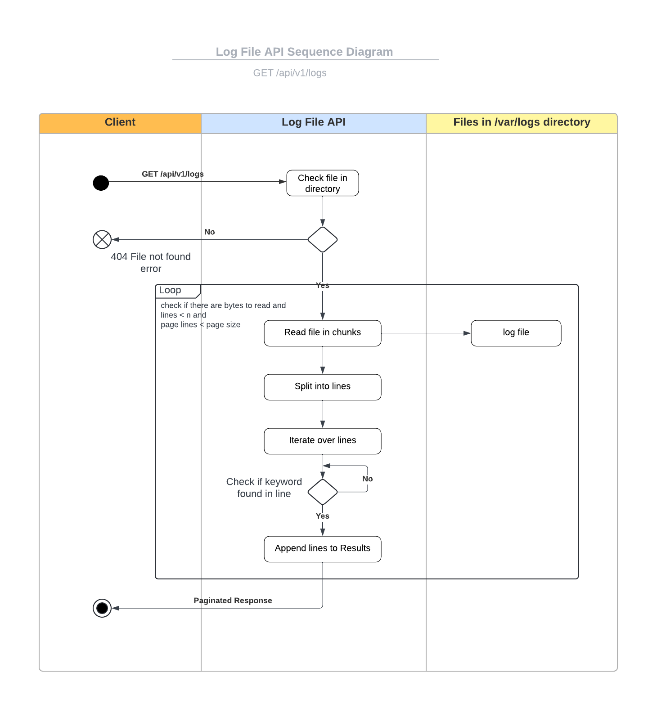

## Purpose:
Create and setup a python environment using Docker to deploy FastAPI application with Gunicorn and nginx.

## Configuration files:
```
/log_file_api
|-- app
|   |-- main.py
|   |-- ...
|
|-- nginx
|   |-- nginx.conf
|
|-- requirements.txt
|-- Dockerfile
|-- docker-compose.yml
```

## Steps
1. Clone github repository

git clone https://github.com/relentless-coder01/log_file_api.git

2. Install Docker by following the instructions

https://docs.docker.com/engine/install/ubuntu/

3. Create Dockerfile

This file contains the configuration for docker. Pulls base image, installs dependencies and runs Gunicorn (Python WSGI server)
```
# Dockerfile
FROM python:3.10-slim

# Set environment variables
ENV PYTHONDONTWRITEBYTECODE=1
ENV PYTHONUNBUFFERED=1

# Set working directory
WORKDIR /app

# Install dependencies
COPY requirements.txt /app/
RUN pip install --no-cache-dir -r requirements.txt

# Copy application code
COPY . /app/

# Run Gunicorn
CMD ["gunicorn", "-w", "4", "-k", "uvicorn.workers.UvicornWorker", "main:app", "--bind", "0.0.0.0:8000"]
```

4. Create nginx.conf

Create a file nginx/nginx.conf. Nginx is the web server / reverse proxy.

```
events {}

http {
    upstream app {
        server web:80;
    }

    server {
        listen 80;

        location / {
            proxy_pass http://app;
            proxy_set_header Host $host;
            proxy_set_header X-Real-IP $remote_addr;
            proxy_set_header X-Forwarded-For $proxy_add_x_forwarded_for;
            proxy_set_header X-Forwarded-Proto $scheme;
        }
    }
}
```

6. Create docker-compose.yaml

This file builds the docker image.
```
version: '3.8'

services:
  web:
    build: .
    ports:
      - "8000:80"
    depends_on:
      - nginx
  nginx:
    image: nginx:latest
    ports:
      - "80:80"
    volumes:
      - ./nginx.conf:/etc/nginx/nginx.conf
    depends_on:
      - web
```

7. Navigate to the project diretory. Build and run your application

```
docker-compose up -d --build
```

8. Access the API at

http://localhost:8000/api/v1/logs

Note: All the configuration files are included in this repository

9. Documentation:

* API Specifications: https://github.com/relentless-coder01/log_file_api/blob/main/docs/Log%20File%20API%20Specification.docx

* Test Cases: 
```
/postman/Log File API.postman_collection.json
```

* Design
[](https://github.com/relentless-coder01/log_file_api/blob/main/docs/Sequence_Diagram.png)

10. UI

Interact with the API using the UI
(https://github.com/relentless-coder01/log_file_api/blob/main/images/ui_page1.jpg)
(https://github.com/relentless-coder01/log_file_api/blob/main/images/ui_page2.jpg)

